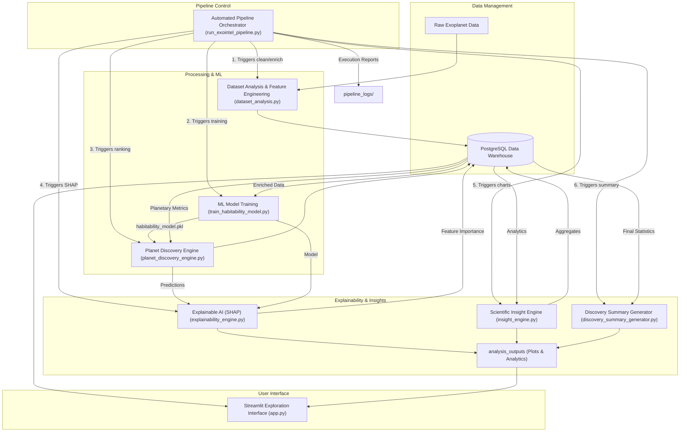

# ExoIntel System Architecture

This document describes the high-level architecture and data flow of the ExoIntel AI Exoplanet Discovery Platform.

## Architecture Diagram

The following Mermaid diagram illustrates the platform's modular structure and the automated pipeline flow.

## Component Descriptions

| Component | Responsibility |
| :--- | :--- |
| **Automated Orchestrator** | Coordinates the sequential execution of the entire pipeline, ensuring data consistency and measuring performance. |
| **PostgreSQL DB** | Central source of truth for raw datasets, feature-engineered tables, discovery rankings, and analytics metrics. |
| **Dataset Analysis** | Cleans raw astronomical data, handles missing values, and computes physics-based metrics like Earth Similarity. |
| **ML Training** | Trains a Gradient Boosting Regressor (or Random Forest) to predict habitability scores based on planetary signatures. |
| **Discovery Engine** | Performs batch inference on the entire catalog to rank and prioritize the most promising exoplanet candidates. |
| **Explainable AI (SHAP)** | Breaks down model "black box" decisions into interpretable feature contributions using SHAP values. |
| **Scientific Insight Engine** | Generates high-level astrophysical visualizations and correlation heatmaps for research analysis. |
| **Summary Generator** | Produces the final executive research summary report based on all pipeline findings. |
| **Streamlit Interface** | Provides an interactive, visual gateway for researchers to explore candidates and simulate habitability. |
